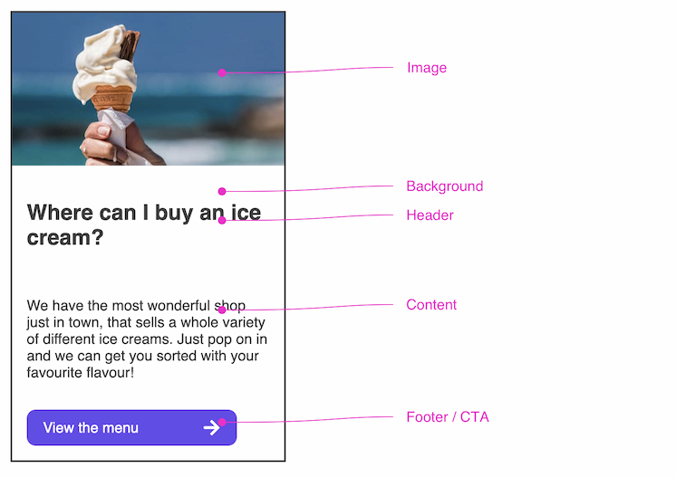
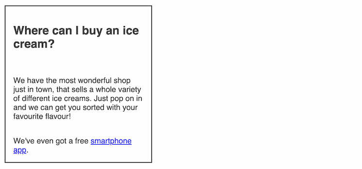
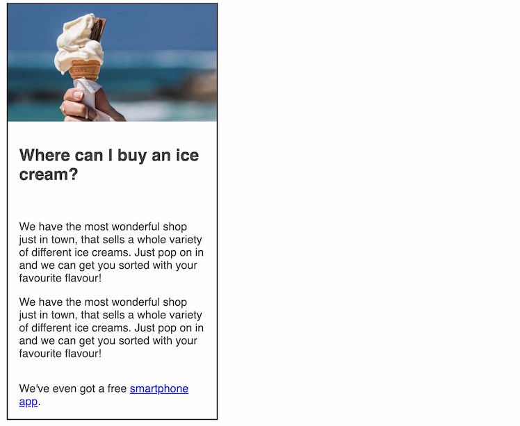
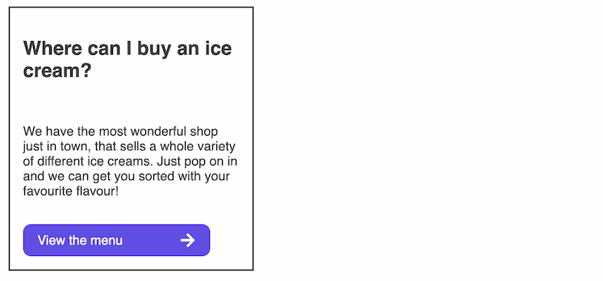

### Anatomy of the component

#### Header

A mandatory main title of the card, H2 by default.

#### Content

A short paragraph that follows the header to provide more detail.

#### Footer

A slot that can be used for a link or a call to action that comes after the the header and content.

#### Image

A path can be added to include an image within the card.

#### Background

Backgrounds can be set to true or false to change the appearance.

---

### Controls

The muon-card can be...

#### Standard

A plain card with just header, content and footer by default.

#### Standard with Image

The same as Standard but with an `image` attribute.

#### Standard with CTA

The same as Standard but with a [`muon-cta`](./cta.md) in the `footer`.

---

### Principles to apply

#### Hierarchy

Consider the position and prominence the cards should have on a page and utilise the image, cta and heading size accordingly.

#### Gestalt

Consider the grouping of a set of cards that could indicate similar or related content. 

#### Balance

Generally, there will be more than one card being used so consider the group structure, the amount that will sit per row or column, spacing and proximity to other content on a page.

#### Progressive disclosure

Focus the user's attention - reduce clutter and cognitive workload. Only present details such as validations when the user needs that information.

---

### Scale

Cards are usually concise amounts of short, relevant and actionable information that lead you to a more detailed page. Therefore, the overall size should be kept fairly small in order to prevent the need to scroll to view the card in its entirety, and to be able to scan further cards that may be a choice within that set. Bear in mind the experience on a small device such as a mobile phone.

---

### Interactive states

The `muon-card` itself has no interactive states by default. Affordance is indicated by links or the `muon-cta` component's states for hover etc.

---

### Accessibility

- Focus
---

### Content

- Inputs

---

### Behaviour

- Key...

---

### Best practice

#### Do

- Only...

#### Don't

- Use...

---
