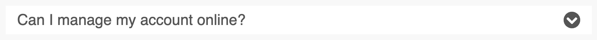

### Icons

The muon-detail component has a property that provides the option to display an additional icon.

#### Standard

With a heading, content and functional chevron icon.



#### With Icon

This example has an additional decorative icon the opposite side to help convey meaning and identification when seen amongst multiple instances of the component.


---

### Anatomy of the component

The muon-detail component is made up from 3 to 4 parts depending on the type:


#### Heading

The summary of the content we show or hide. It is interactive and therefore should have affordance - by default the underlining of text as a link and an outline for the the focus state. The heading also has a background that extends full width and behind any icons used.

#### Content

This displays when the Detail component is opened and hides when it is closed. Any interactive elements within this section should not be focusable or interactive when in the closed state.

#### Functional icon

By default, it uses a chevron that points down when closed and up when open - indicating the intent.

#### Decorative icon

Only available on the With Icon type of the muon-detail component, the decorative icon is situated on the opposite side to help convey meaning and identification.

---

### Principles to apply

#### Hierarchy

Showing the difference in importance of the elements - ie. between header and content

#### Gestalt

Similarity of each muon-detail component, proximity of the group. Also see [law of proximity](https://lawsofux.com/law-of-proximity/).

#### Balance

Start/end positioning of icons.

#### Progressive disclosure

Focus the user's attention - reduce clutter and therefore cognitive workload - only presenting details of a section when clicked/tapped - when the user wants it.

---

### Accessibility

#### Support for keyboard

- ```Space or Enter``` = Changing the collapsed/expanded state of each expander
- ```Tab``` = navigating next focusable element
- ```Shift+Tab``` = navigating previous focusable element

Ref: <https://www.w3.org/TR/2018/NOTE-wai-aria-practices-1.1-20180726/examples/accordion/accordion.html>

#### Screenreaders / ARIA

- heading
- open true/false
- content panel (if ```<aria-open="true">```)

#### Colours & Contrast

Meet or exceed WCAG 2.1 AA compliance.

---

## Scale

Minimum target size for interactions with a touch device is 44px x 44px <https://www.w3.org/WAI/WCAG21/Understanding/target-size.html>

At mobile viewports, it is common practice for accordions to display at full width for best affordance and room for the heading slot's text.

If text is longer than the width of its container, it will wrap appropriately, pushing down the lower margin of the component to retain consistent spacing so as not to interfere with any icon being used.

Worth considering [Fitts' law](https://lawsofux.com/fittss-law/)

---

### Interactive states

#### Default (closed)


#### Hover (closed)


#### Focus (closed)


#### Open


---

### Best practice

#### Do

- Use in multiples within a set
- Use instead of a modal
- Use to disclose progressively and so remove visual clutter
- Ensure section headings relate to content
- Use headings, paragraphs, lists for content

#### Don't

- Use more than 8 expanders (stop to reassess your content if you think you need more) See [Hick's Law](https://lawsofux.com/hicks-law/) - The time it takes to make a decision increases with the number and complexity of choices.
- Use to hide important information (such as caveats)
- Use as a solution to excessive copy on a page
- Nest muon-detail components within other muon-detail components.

---
