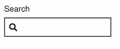

### Anatomy of the component

#### Label

Every single `muon-inputter` must have a label to identify the form control and should describe its purpose – which helps users understand. See https://www.w3.org/WAI/tutorials/forms/labels/

#### Input area

The section a user interacts with to enter information or indicate a preference. It could be a text box, radio button, selector or checkbox etc.

Example of an input area with data added:

#### Helper text

Each `muon-inputter` can have optional helper text added for additional in-context assistance. This is a short sentence that appears below the label in the hierarchy of elements and its purpose is to help the user fill in the input.

#### Tip detail

Each `muon-inputter`'s helper can have an optional tip added for further detail and in-context assistance. This is a short sentence that appears below the helper in the hierarchy of elements and is always used in conjunction with the helper.

#### Headings

This attribute is used for a group of checkboxes or radio buttons, where the label is adjacent to each `muon-inputter` checkbox or radio button.

#### Validation

This is used for error prevention. It checks the format of the inputted content against the required criteria. By default, it uses the minimal `isRequired`, but can vary depending on the `muon-inputter` type – for example, an Email type requires the format to contain an '@' symbol etc. The validations are optional and can be configured to requirements.

#### Placeholder

This provides the user with an example of the expected input. The placeholder text disappears when the user starts typing.

#### Masks and separators

A mask can be used to show what can be entered. A separator is used with the mask to manipulate the inputted value if it needs to be in a specific format, such as a bank sort code.

### Number min/max

The Number type of `muon-inputter` can be formatted to have a minimum and maximum value. For example the minimum might be 0 and the maximum 10 (by default) so the user cannot enter a value higher or lower than this, nor can they increase/decrease the value outside of the range by using the arrows that appear when interacting with it.

---

### Types

This is a very versatile and expansive component used in forms – there are 15 types of `muon-inputter`:

#### Text

#### Email

#### Tel

#### Search

#### Password

#### Disabled

#### Date

#### Date Mask

#### Mask

#### Separator

#### Number

#### Textarea

#### Checkbox

#### Radio

---

### Principles to apply

#### Hierarchy

Showing the difference in importance of the elements - ie. between header labels, helper text, tips, validations etc

#### Gestalt

The similarity of each inputter, such as uniform outlines, input area height, grouping and order. [Law of similarity](https://lawsofux.com/en/law-of-similarity/).

The proximity of the group - eliminate ambiguity, and help the user understand what information is part of the group in a form, eg. labels belonging to text inputs etc. Also see the [law of proximity](https://lawsofux.com/law-of-proximity/).

#### Balance

Start/end positioning of icon. Consider context - multiple variants are commonly used within one form.

#### Progressive disclosure

Focus the user's attention - reduce clutter and cognitive workload. Only present details such as validations when the user needs that information.

---

### Scale

The minimum target size for interactions with a touch device is 44px <https://www.w3.org/WAI/WCAG21/Understanding/target-size.html>

All radio input areas such as text fields and radio buttons should adhere to this rule for accessibility.

The input size correlates to its expected value, such as postcodes, telephone numbers and max length.

---

### Interactive states

Each `muon-inputter` component has a visual cue of its interactive state that is common or coherent across all its types.

#### Text type inputs

#### Checkboxes

#### Radio buttons

#### Select

The `muon-inputter` Select opens a native dropdown - not a customised one.

#### Helper and Tip text interaction states

---

### Accessibility

- Focus states and tabbing order throughout the whole form. Use `muon-cta` to submit.
- Colours and contrast meet or exceed WCAG 2.1 AA 
- Changing of shape on interactive states - don't rely on the use of colour alone.
- The minimum target size for interactions (44px) https://www.w3.org/WAI/WCAG21/Understanding/target-size.html
- To make forms usable with screen readers, Labels should always be used to ask the question that the input value answers. The exception being that Labels for Checkboxes and Radios are the answers to a posed question in the parent heading.

---

### Content

- Inputs use native autocompletes. They will resize when using that attribute.
- Spellcheck should be disabled for names within a text input and allow for accented characters, spaces and special characters such as hyphens, commonly found in people's names.
- Consideration should be made for the right to left read order for internationalisation (eg. Arabic etc.) which can also affect the location of functional type icons within inputters.
- Don't use invisible elements.
- The input size correlates to its expected value, such as postcodes, telephone numbers and max length.

---

### Behaviour

- Keyboard focus should tab through in the same order of appearance of the inputters.
- Text entered into an inputter that is longer than the initial size of the field will behave like the browser's default.
- The Search inputter will display a functional 'clear' icon at the opposite end to the search icon whilst text is being input, allowing the user to clear the contents if they wish.
- Password should be hidden by default.
- Clicking the functional icon on the Date should open the native datepicker calendar.
- Textarea has a grab handle allowing the user to resize to view more of the text being entered but is  also scrollable.
- Inputters default widths fit within the smallest viewport (320px wide)
- By default inputter components stack in one column vertically and singly.
- Radios and checkboxes are not selected by default leaving this choice to the user.

---

### Best practice

#### Do

- Only use the specified text type (eg. Text, Email etc.)
- Use the autocomplete attribute
- Base the width of input on the expected length of the input
- Always include a label and keep them concise
- Make labels easy to read and understand
- Keep the heading/legend short
- Associate every radio button with its label using ID & for attributes
- Consider using a Select for more than 5 radio buttons (but remember this effectively hides options)
- Use only one label with each checkbox
- If adding a "Please Select" option then add an empty value="" attribute
- Use headings to introduce a set of checkboxes or radio buttons
- Keep Helper text to one line
- Use Helper text to explain why info is needed
- Use Tip text for more context in conjunction with a helper, for explanation or as a prompt
- Use Placeholder text to provide an example of the expected input into a field
- Use Validation to assist the customer to identify errors when entering information and how they might correct it
- Use combinations of validation types where required (`isRequired`, `isNumber`, etc.)
- Use validation only when it is required
- Use `ns-fieldset` to help group fields that capture related data, and create hierarchy within your form

#### Don't

- Use more than one text input within an inputter
- Use just one radio button
- Pre-select an option radio button or checkbox (let the user choose)
- Use standard radio buttons horizontally adjacent to each other
- Use Checkboxes as Lists
- Use Checkboxes as Radio buttons and vice versa
- Use Helper text for error messaging
- Use real data as placeholders
- Use `mask` or `separator` on textarea, checkbox or radio button inputters
- Start or end with a separator (by definition it needs to be between the separated items)
- Change the tabbing order from the visual order in which inputs appear

---
